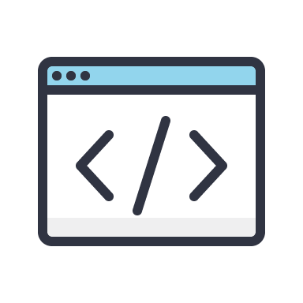

<!-- PROJECT SHIELDS -->
<!--
*** I'm using markdown "reference style" links for readability.
*** Reference links are enclosed in brackets [ ] instead of parentheses ( ).
*** See the bottom of this document for the declaration of the reference variables
*** for contributors-url, forks-url, etc. This is an optional, concise syntax you may use.
*** https://www.markdownguide.org/basic-syntax/#reference-style-links
-->

[![Contributors][contributors-shield]][contributors-url]
[![Forks][forks-shield]][forks-url]
[![Stargazers][stars-shield]][stars-url]
[![Issues][issues-shield]][issues-url]

<!-- PROJECT LOGO -->
<br />
<p align="center">
  <a href="https://github.com/AlexandruRoman/snippets-store-backend">
    
  </a>

  <h3 align="center">Snippets Store</h3>

  <p align="center">
    The perfect place for your code inspiration
    <br />
    <br />
    <a href="https://github.com/AlexandruRoman/snippets-store-backend/issues">Report Bug</a>
    ·
    <a href="https://github.com/AlexandruRoman/snippets-store-backend/issues">Request Feature</a>
  </p>
</p>

<!-- TABLE OF CONTENTS -->

## Table of Contents

- [About the Project](#about-the-project)
  - [Built With](#built-with)
- [Getting Started](#getting-started)
  - [Prerequisites](#prerequisites)
  - [Installation](#installation)
- [Usage](#usage)
- [Roadmap](#roadmap)
- [Contributing](#contributing)
- [License](#license)

<!-- ABOUT THE PROJECT -->

## About The Project

[![Snippet Store Showcase][product-screenshot]](https://github.com/AlexandruRoman/snippets-store-backend)

Snippets Store is an online platform which was built with the purpose of helping programmers build good looking interfaces. Web programming is a vast domain, frontend programmers are facing day by day more and more challenges implementing applications that are conforming with modern quality standards, making them to focus more on optimisations, micro-interactions and complex flows instead of design aspects. In the same time, the design proces a complex task, a domain in continual transformation and change of trends.

The term of programming is used having in mind scripting languages and not declarative languages like HTML or CSS. The majority of web designers have control over those 2 technologies, making them able to share their knowledge and talent with the less experimented programmers. This web application aims to be the linking bridge between programmers and designers.

### Built With

- [Node.js](https://nodejs.org)
- [Express.js](https://expressjs.com)
- [TypeScript](https://www.typescriptlang.org)
- [Mongo DB](https://www.mongodb.com)
- [Mongoose](https://mongoosejs.com/)

<!-- GETTING STARTED -->

## Getting Started

To get a local copy up and running follow these simple example steps.

### Prerequisites

- [Install Node.js](https://nodejs.org/en/download/)

### Installation

1. Clone the repo

```sh
git clone https://github.com/AlexandruRoman/snippets-store-backend.git
```

2. Install NPM packages

```sh
npm install
```

3. Enter your Mongo connection string in `src/mongo.ts`

```JS
const url = 'YOUR CONNECTION STRING'
```

<!-- USAGE EXAMPLES -->

## Usage

This REST API has the endpoints grouped in 4 main categories:

- finance
- identity
- impressions
- products

These endpoints can be found under src/\_GROUP. The API project uses a feature first architecture so the each endpoint has his own separate file.

An example of getting the details of a snippet using curl:

```bash
curl -X GET http://localhost/snippet/get/3
```

<!-- ROADMAP -->

## Roadmap

See the [open issues](https://github.com/AlexandruRoman/snippets-store-backend/issues) for a list of proposed features (and known issues).

<!-- CONTRIBUTING -->

## Contributing

Contributions are what make the open source community such an amazing place to be learn, inspire, and create. Any contributions you make are **greatly appreciated**.

1. Fork the Project
2. Create your Feature Branch (`git checkout -b feature/AmazingFeature`)
3. Commit your Changes (`git commit -m 'Add some AmazingFeature'`)
4. Push to the Branch (`git push origin feature/AmazingFeature`)
5. Open a Pull Request

<!-- LICENSE -->

## License

Distributed under the MIT License.

<!-- CONTACT -->

<!-- ACKNOWLEDGEMENTS -->

<!-- MARKDOWN LINKS & IMAGES -->
<!-- https://www.markdownguide.org/basic-syntax/#reference-style-links -->

[contributors-shield]: https://img.shields.io/github/contributors/AlexandruRoman/snippets-store-backend.svg?style=flat-square
[contributors-url]: https://github.com/AlexandruRoman/snippets-store-backend/graphs/contributors
[forks-shield]: https://img.shields.io/github/forks/AlexandruRoman/snippets-store-backend.svg?style=flat-square
[forks-url]: https://github.com/AlexandruRoman/snippets-store-backend/network/members
[stars-shield]: https://img.shields.io/github/stars/AlexandruRoman/snippets-store-backend.svg?style=flat-square
[stars-url]: https://github.com/AlexandruRoman/snippets-store-backend/stargazers
[issues-shield]: https://img.shields.io/github/issues/AlexandruRoman/snippets-store-backend.svg?style=flat-square
[issues-url]: https://github.com/AlexandruRoman/snippets-store-backend/issues
[linkedin-shield]: https://img.shields.io/badge/-LinkedIn-black.svg?style=flat-square&logo=linkedin&colorB=555
[linkedin-url]: https://www.linkedin.com/in/alexandru-daniel-roman/
[product-screenshot]: screenshot.png
